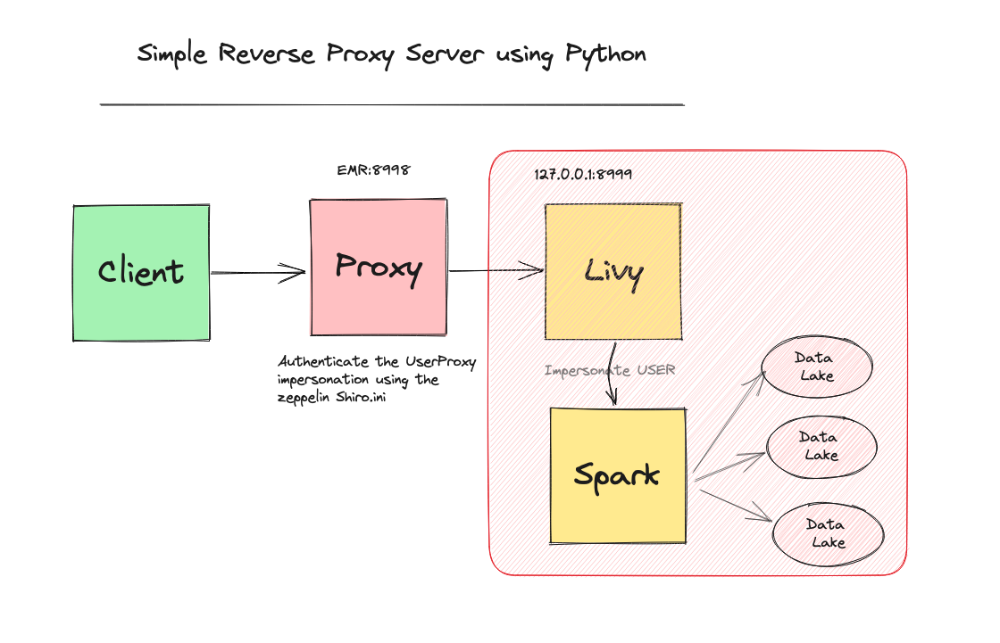

# Livy Reverse Proxy Server

This project is a simple TCP reverse proxy server, able to forward from IP:Port such as 127.0.0.1:8998 to an 
internal or external IP:Port. The server is configured using the Apache Shiro security framework, allowing for user authentication 
through Shiro's INI configuration.



At [Involve Asia](https://involve.asia), we use the **ProxyUser** that associated with IAM Role to grant access to
[EMRFS](https://docs.aws.amazon.com/emr/latest/ManagementGuide/emr-emrfs-iam-roles.html)
based on the authenticated user.

## Prerequisites
* Python 3.7+
* Apache Zeppelin with Shiro Authentication 
* Apache Livy

## Setup and Configuration

Please note that by default, this project should work right of the box
with AWS EMR. You may need to use this guideline to configure the 
[Livy](https://docs.aws.amazon.com/emr/latest/ReleaseGuide/emr-jupyterhub-user-impersonation.html)

Clone this repository from the Master EC2 machine :

```bash
cd /home/hadoop/
git clone https://github.com/mahadirz/livy-reverse-proxy
cd livy-reverse-proxy
```

Before you can run the server, you'll need to set up your Shiro INI configuration file. 
You can do this by editing the shiro.ini file in the /etc/zeppelin/conf/ directory.

Running the Server
You can run the server with the following command:

```bash
python proxy_server.py
```
The server will listen on 0.0.0.0:8998 and forward to 127.0.0.1:8999 by default.

## Customizing the Server
You can customize the server's configuration through command-line arguments:

* --server_address: the IP and port the server will listen on. Default is 0.0.0.0:8998.
* --forward_to: the IP and port the server will forward to. Default is 127.0.0.1:8999.
* --shiro_path: the path to the Shiro INI file. Default is /etc/zeppelin/conf/shiro.ini.
* --log_level: the logging level. Default is INFO.

For example, to run the server on 192.168.1.2:8000 and forward to 192.168.1.3:9000, you would use the following command:

```bash
python proxy_server.py --server_address 192.168.1.2 8000 --forward_to 192.168.1.3 9000
```

To automatically 

```bash
sudo cp proxy.service /usr/lib/systemd/system/
sudo systemctl daemon-reload
sudo systemctl enable proxy
sudo service proxy start
```

## Contributing

Please feel free to submit issues, fork the repository and send pull requests!